# Pronounce

An iOS app for language learners who study from physical books. Pronounce lets you scan book pages with your camera, extract and tokenize sentences, look up words in the built-in dictionary, practice pronunciation by recording yourself, and hand-write characters — all in one place.

Built with **SwiftUI** and **CoreData**, targeting iOS 16.6+.

---

## Features

- **Book Shelf** — organise your physical books digitally with cover photo, title, and author
- **Page Scanner** — scan book pages using the document camera, with automatic perspective correction
- **Sentence Extraction** — sentences are parsed from the scanned page and listed individually; each expands to show its component words
- **Dictionary Lookup** — tap any word to pull up a full dictionary entry with definitions, example phrases, and related words
- **Word Search** — search across all words you've encountered in a book
- **Pronunciation Practice** — listen to the native pronunciation of a word and record yourself reading it aloud; recordings are date-stamped so you can track progress
- **Script Practice** — draw the character freehand on a canvas, save your attempts, and review past scripts
- **Page History** — replay all recordings made for a given page

---

## Screenshots

### Book Shelf & Adding a Book

|                Book Shelf                |               Add a Book               |
| :--------------------------------------: | :------------------------------------: |
| 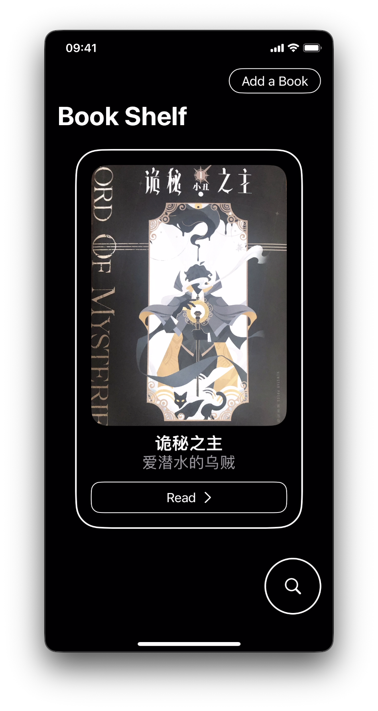 | 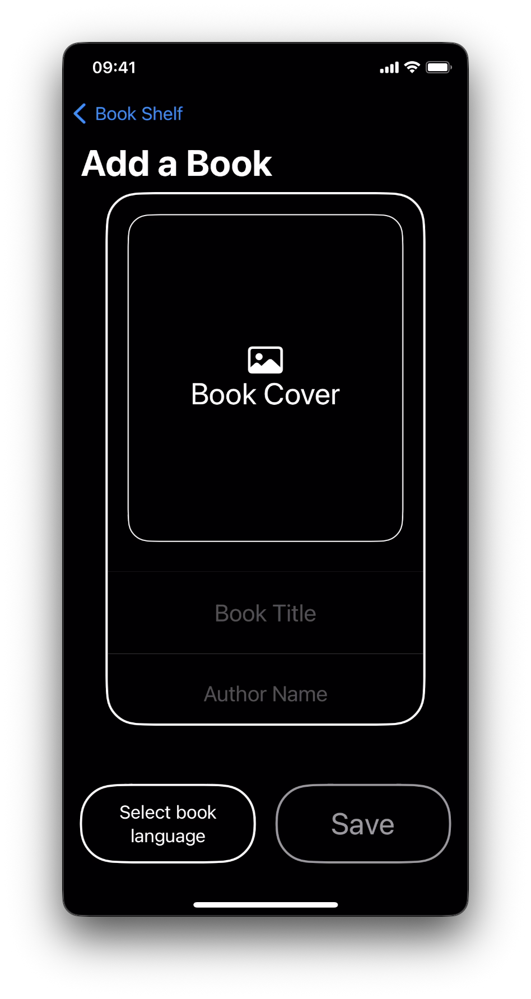 |

Browse your saved books from the shelf. Tap **Add a Book** to register a new one — upload a cover photo, enter the title and author, and select the book's language.

---

### Reading Pages

|           Pages List            |               Page Controls                |
| :-----------------------------: | :----------------------------------------: |
| 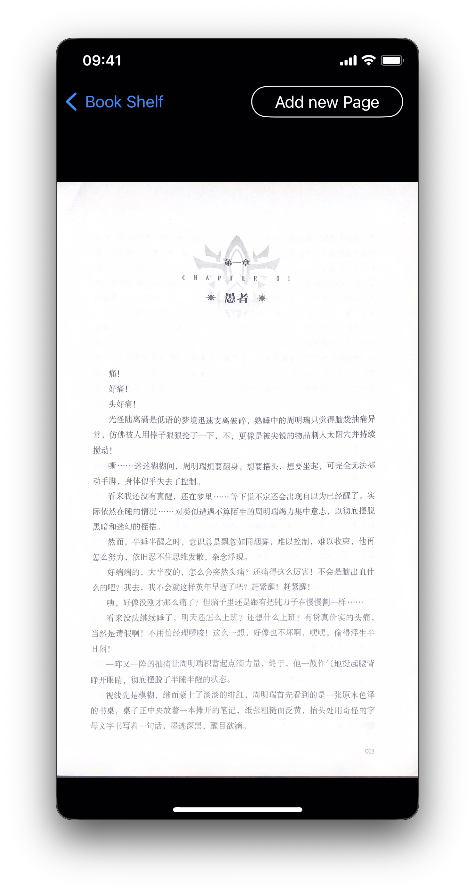 | 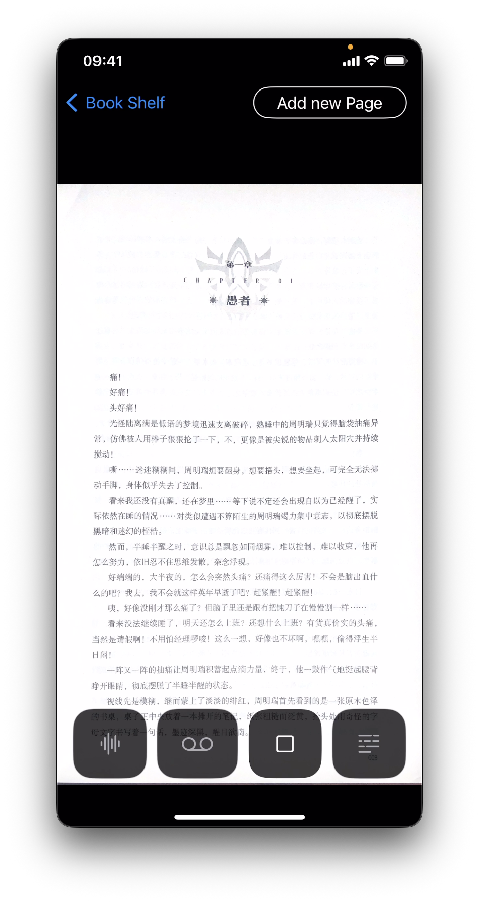 |

Each book holds photographed pages. Open a page to view the full-resolution scan. The control bar at the bottom gives quick access to audio waveform visualisation, recording playback, recording capture, and sentence scanning.

---

### OCR & Sentence Scanning

<p align="center">
  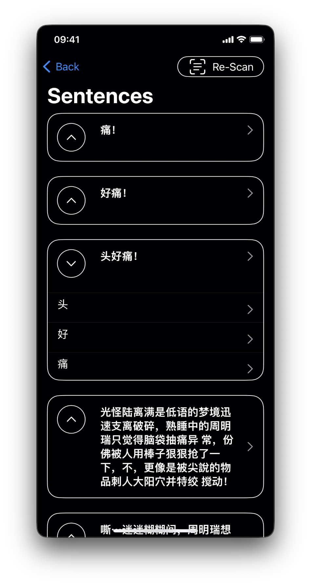
</p>

After tapping the scan button, the app runs OCR on the page image and tokenizes the result into sentences and words using the Natural Language framework. Every sentence appears as a collapsible card; expanding it reveals each individual word as a tappable row, letting you drill straight into the dictionary or pronunciation flow.

---

### Word Detail, Dictionary & Search

|           Word View           |                Dictionary                 |                 Word Search                 |
| :---------------------------: | :---------------------------------------: | :-----------------------------------------: |
|  | 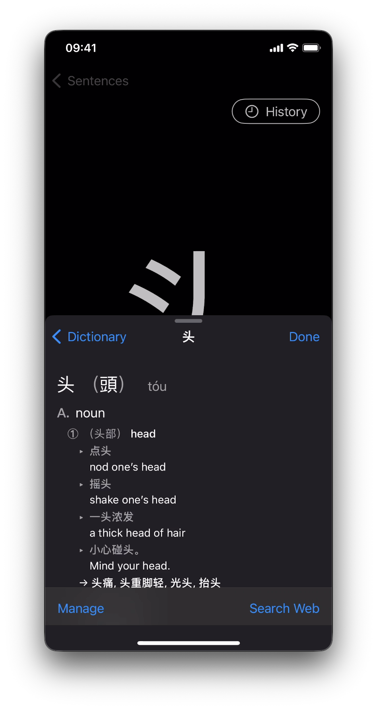 | 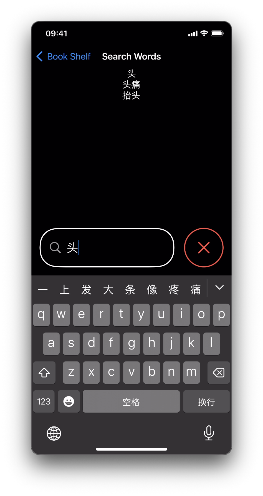 |

Tapping a word opens a full-screen character view with **Pronounce** and **Script** actions. The system dictionary sheet slides up with the full definition, pinyin/romanisation, example phrases, and related words. A search bar lets you find any word encountered across the whole book.

---

### Pronunciation & Recording

|                 Record                  |                 Word Records                 |                 Page History                 |
| :-------------------------------------: | :------------------------------------------: | :------------------------------------------: |
| 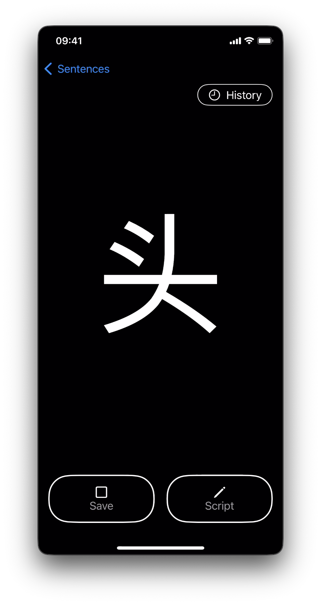 | 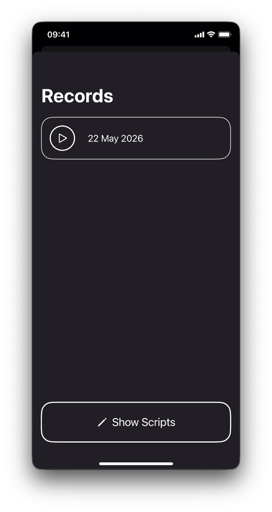 | 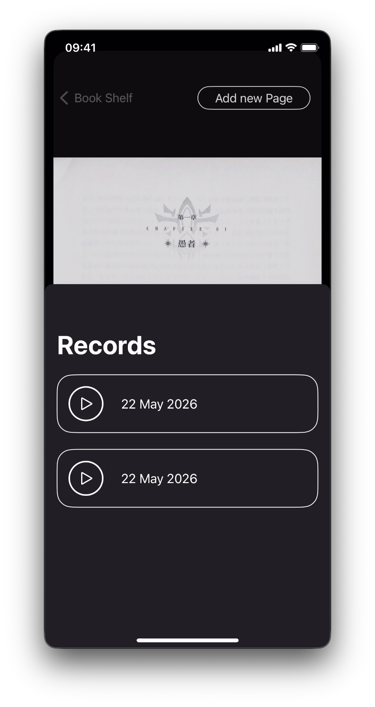 |

Tap **Pronounce** to hear the word spoken aloud and record yourself reading it back. All recordings are date-stamped and listed under **Records** so you can track your improvement over time. **Page History** collects every recording made across an entire page in one place.

---

### Script (Handwriting Practice)

|           Script Canvas           |                Saved Scripts                 |
| :-------------------------------: | :------------------------------------------: |
| 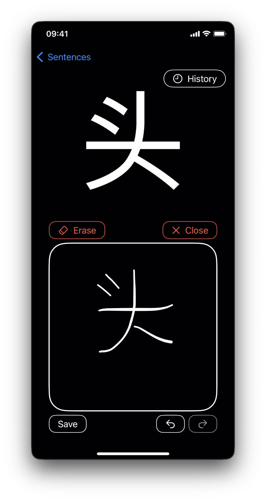 | 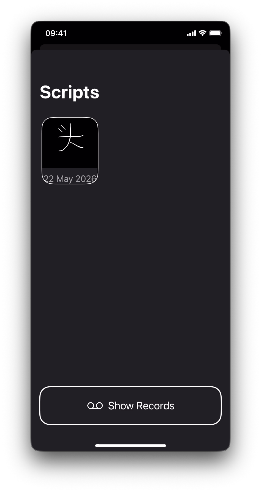 |

The **Script** screen shows the reference character at the top and gives you a freehand canvas below. Use **Erase** to clear the canvas, undo/redo individual strokes, and **Save** to add the attempt to your scripts gallery.

---

## Project Structure

```
Pronounce/
├── Helpers/
│   ├── Services/           # Audio helpers, LocalImageProcessor (OCR + NL tokenization)
│   ├── CustomButtonStyles  # Reusable SwiftUI button modifiers
│   ├── PagingScrollView    # Custom paging scroll component
│   └── ShakeEffect         # Animation helper
├── Models/
│   ├── Extensions/         # Swift type extensions
│   ├── PronounceContainer  # CoreData stack setup
│   └── PronounceModels     # CoreData entity models
├── Resources/              # Assets, localisation
└── Views/
    ├── BookShelf/
    │   ├── Components/     # BookCardView, ControlBarButton, RecordPlayerCard,
    │   │                   #   ScriptCard, SentenceCard
    │   └── Views/
    │       ├── AddABook/   # Add-book form
    │       ├── BookDetails/# Per-book detail screen
    │       ├── BookPages/  # Page list and page viewer
    │       ├── Search/     # Word search
    │       └── Sentence/   # Sentence & word drill screens
    └── Search/             # Global search
```

---

## Tech Stack

| Concern                    | Technology                 |
| -------------------------- | -------------------------- |
| Language                   | Swift 5.9                  |
| UI                         | SwiftUI                    |
| Persistence                | CoreData                   |
| Document scanning & OCR    | Vision framework           |
| Text tokenization          | Natural Language framework |
| Audio recording & playback | AVFoundation               |
| Text-to-speech             | Speech Synthesis           |
| Dictionary                 | System reference library   |
| Minimum target             | iOS 16.6                   |

---

## Getting Started

1. Clone the repo
2. Open `Pronounce.xcodeproj` in Xcode 15+
3. Select a simulator or device running iOS 16.6+
4. Build and run (`⌘R`)

No external dependencies or package manager setup required — the project uses only Apple first-party frameworks.
